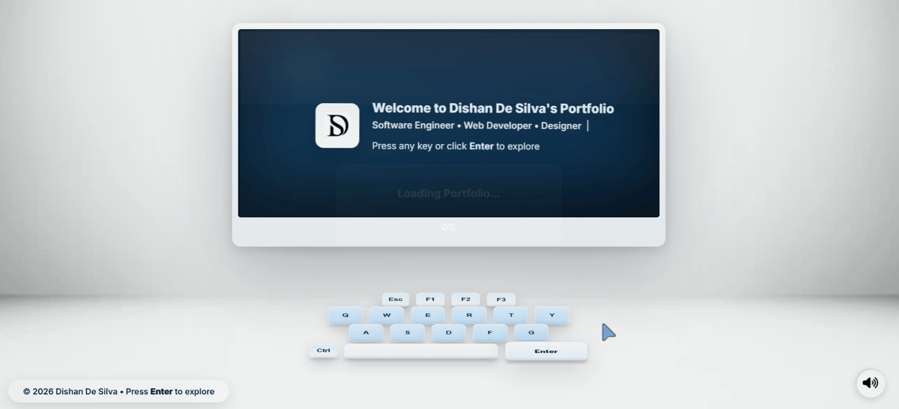
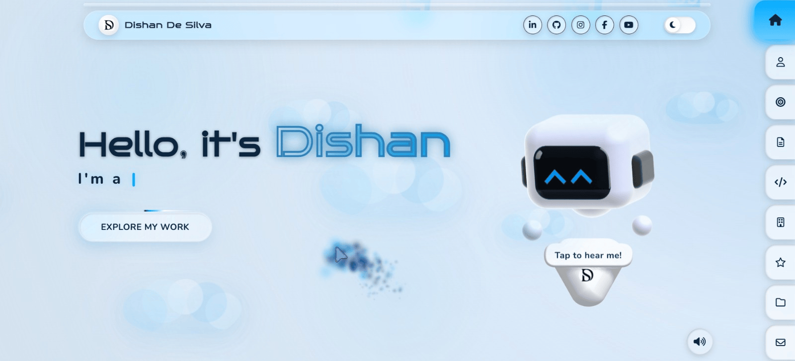

# <div align="center">Dishan De Silva - Portfolio</div>

<div align="center">
  
</div>

<div align="center">

Modern full-stack portfolio engineered to present technical depth, product thinking, and polished execution in a recruiter-friendly format.

Built as a real-world personal brand experience with modular PHP architecture, performance-conscious frontend delivery, and production-style project presentation.

[View Live Portfolio](https://dishandesilva.kesug.com/) | [Explore Project Structure](#project-structure) | [Tech Stack](#tech-stack)

</div>

---

## Overview

This repository powers the public portfolio of Dishan De Silva, a full-stack developer focused on building practical digital products with strong visual quality and clean system design. The project is structured like a production-ready marketing and portfolio platform rather than a simple static profile page, combining frontend craft, reusable PHP composition, and scalable content organization.

It is designed to communicate engineering capability quickly: who is building, what technologies are in play, how the interface is structured, and how real project work is surfaced through a polished portfolio system.

---

## Live Demo

<div align="center">
  <a href="https://dishandesilva.kesug.com/" target="_blank">
    
  </a>
  <a href="https://dishandesilva.kesug.com/" target="_blank">
    
  </a>
</div>

---

## Key Features

- Premium landing-page presentation built for personal branding, recruiter review, and client-facing credibility
- Modular PHP composition using reusable includes for maintainable page assembly
- Production-style project showcase system with spotlight presentation and live preview access
- Responsive interface architecture optimized across desktop, tablet, and mobile breakpoints
- Performance-aware asset loading with deferred scripts, lazy loading patterns, and optimized media delivery
- SEO-ready page foundation with metadata, canonical handling, and social sharing support
- Theme-aware UI experience with persistent user preference handling
- Deployment-ready structure suitable for XAMPP local development and standard PHP hosting environments

---
## Tech Stack

<div align="center">
  
</div>

| Layer | Stack |
| --- | --- |
| Frontend | HTML5, CSS3, Vanilla JavaScript, Font Awesome, Devicon, Spline-enhanced desktop visuals |
| Backend | PHP with reusable include-based templating |
| Database / Data Layer | JSON-driven project data architecture, MySQL listed as part of broader working stack |
| Tools | Git, GitHub, XAMPP, VS Code, CDN-delivered UI libraries |

---

## Project Structure

```text
portfolio-dishan-de-silva/
|-- index.php
|-- home.php
|-- includes/
|   |-- head.php
|   |-- header-top.php
|   |-- navbar.php
|   `-- footer.php
|-- assets/
|   |-- audio/
|   |-- img/
|   |-- scripts/
|   |   |-- hero-2d.js
|   |   |-- home.js
|   |   |-- main.js
|   |   |-- navbar.js
|   |   |-- scrollbar.js
|   |   `-- splash.js
|   |-- styles/
|   |   |-- animations.css
|   |   |-- base.css
|   |   |-- home.css
|   |   |-- main.css
|   |   |-- navbar.css
|   |   |-- scrollbar.css
|   |   |-- sections.css
|   |   |-- splash.css
|   |   `-- vars.css
|   |-- svg/
|   `-- video/
|-- data/
`-- preview/
```

---

## Architecture

### Frontend Architecture

The UI is built as a modern section-based portfolio experience with a strong emphasis on interaction quality, responsive composition, and brand presentation. Styling is separated into focused CSS layers for tokens, layout foundations, section behavior, motion, navigation, and page-specific presentation.

### Modular PHP System

The backend structure uses lightweight PHP includes to keep shared layout concerns centralized. This makes the portfolio easier to extend, easier to maintain, and cleaner to deploy without introducing unnecessary framework overhead.

### Performance Optimization Layer

The delivery layer is tuned for practical performance through deferred JavaScript loading, organized asset versioning, lazy-loading patterns, and streamlined static asset usage. The result is a portfolio system that feels polished without becoming heavy.

---

## Project Showcase System

This portfolio includes a real production-style project module designed to present work in a more intentional way than a basic grid of cards.

- Spotlight-oriented presentation for featured work
- Category-based filtering and structured metadata handling
- Live preview access built into the project experience
- Placeholder states prepared for future releases without low-quality filler content
- Frontend logic organized for maintainability and future scale

---

## Preview




---

## Local Development

1. Start Apache in XAMPP.
2. Place this project inside `htdocs`.
3. Open `http://localhost/<project-folder>/` in your browser.

---

## Deployment

- Upload the project to your hosting root such as `public_html`
- Point the domain or subdomain to the portfolio directory
- Enable HTTPS and verify canonical routing
- Keep asset versions updated when shipping visual or script changes
- Validate all core sections and live project links after release

---

## Maintenance

- Update showcase content through the project data layer and frontend rendering logic
- Extend styles within the modular CSS architecture to preserve consistency
- Review responsiveness, interaction polish, and asset loading when shipping new sections

---

## Author

**Dishan De Silva**  
Software Engineer  
Founder of Azureline

---

## License

This project is published for portfolio presentation and professional evaluation.  
The design system, branding, written content, and implementation remain the intellectual property of Dishan De Silva. Reuse, redistribution, or commercial replication without permission is not authorized.
